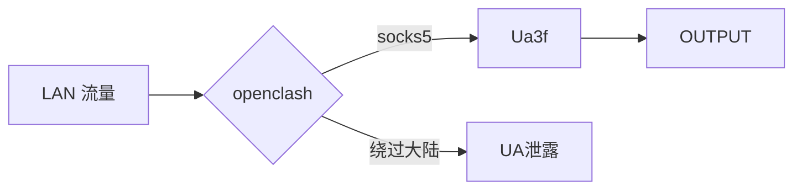
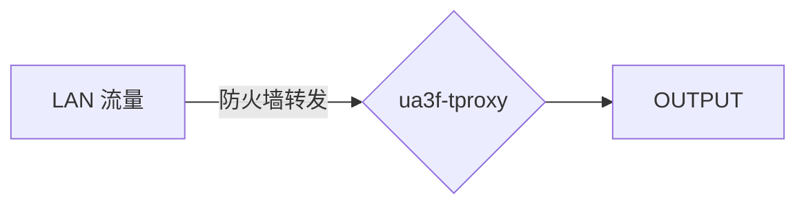
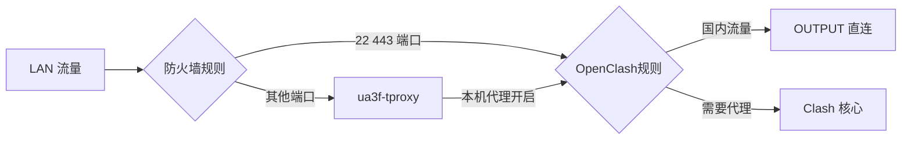
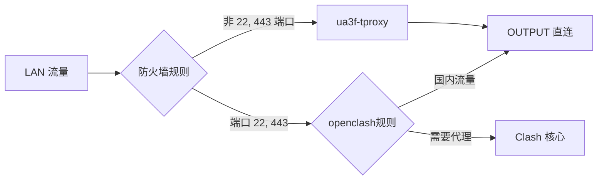

# UA3F-TProxy


[](https://github.com/Zesuy/UA3F-tproxy/releases)
[](https://github.com/Zesuy/UA3F-tproxy/blob/main/LICENSE)

一个为 OpenWrt 设计的高性能、低内存 User-Agent 修改工具 (带 LuCI 界面)。

本项目基于 [UA3F](https://github.com/SunBK201/UA3F) 重构，但使用 `TProxy (REDIRECT)` 方式重定向防火墙流量，实现了**卓越的性能**和**极低的内存占用**。

> [!IMPORTANT]
>
> **项目现已原生支持 `iptables`！**
>
>  `ua3f-tproxy` 现在可以完美运行在 **OpenWrt 21.02, 22.03** 等旧版固件上。
>
> - **OpenWrt 23.05+ 用户**: 请使用默认的 `nftables` 版本 (`ua3f-tproxy_*.ipk`)。
> - **OpenWrt 21.02 / 22.03 用户**: 请从 Release 页面下载 `iptables` 版本 (`ua3f-tproxy-ipt_*.ipk`)。
>
> 两者功能完全相同，且都与 OpenClash 等插件兼容。


## 🎯 解决了什么问题？

本项目主要用于解决**校园网环境对多设备共享上网的检测**问题。

与此前的解决方案相比：

  * **ua2f**: 需要特定的内核功能，必须手动编译固件，使用不便。
  * **ua3f (原版)**: 依赖 Clash 等代理服务通过 SOCKS5 转发，所有流量（包括国内）都需经过代理核心，性能开销和内存占用巨大，不适合低性能的硬路由。

`ua3f-tproxy` 解决了以上痛点，它**不依赖Clash**，性能极高，配置极其简单。

## ✨ 核心特性

  * 🚀 **一键启用**: 根据您安装的版本自动配置 `nftables` 或 `iptables` 防火墙，无需任何额外配置
  * ⚡ **高性能**: 采用 TProxy 架构，流量路径短，开销极低。
  * RAM **低内存占用**: 不依赖 Clash 核心，内存占用仅 **数MB**。
  * 🤝 **高兼容性**: 可与 `mwan3`, `openclash`, `sqm_qos` 等常见插件完美共存。
  * 🍃 **无侵入**: 配置基于 UCI，卸载后不留任何防火墙残余。


## 📊 架构对比

`ua3f-tproxy` 极大地优化了流量处理路径。

### 1\. ua3f (Socks5 方案)

所有流量（包括国内）都必须经过 Clash，性能损失大。



### 2\. ⚡ ua3f-tproxy (TProxy 方案)

#### 场景一：单独使用（推荐）

  * 无需依赖 OpenClash 即可修改 UA，性能最高。

<!-- end list -->



#### 场景二：与 OpenClash 配合 (完美分流)

  * **配置**：ua3f-tproxy (代理本机: `关闭`) + openclash (代理本机: `开启`, 绕过大陆: `开启`)
  * **效果**：实现完美分流。非 `22/443` 端口流量先由 `ua3f-tproxy` 修改 UA (HTTP)，再统一交由 `OpenClash` 接管。`OpenClash` 会将国内流量直连，国外流量走代理。
  * **备注**：此模式下，如果关闭 OpenClash 的“绕过大陆”，则所有流量（HTTP/HTTPS）都会先过 `ua3f-tproxy` 再过 `OpenClash`，性能与原版 `ua3f` 近似。

<!-- end list -->



#### 场景三：与 OpenClash 配合 (有缺陷，最大兼容)

  * **配置**：ua3f-tproxy (代理本机: `关闭`) + openclash (代理本机: `关闭`，绕过大陆: `开启`)
  * **效果**: 这是一种**割裂**的配置。`OpenClash` 将**仅**代理被 ua3f-tproxy 绕过的端口 (默认 `22`, `443`)。**不推荐使用**
  * **缺陷**: 所有其他端口（如 `80` 端口）的流量，在被 `ua3f-tproxy` 修改 UA 后将**全部直连**，**不会**进入 OpenClash 走代理。

<!-- end list -->


## 🧩 luci截图


## 🛠️ UA 替换模式说明

### 1\. 局部替换 (正则)

  * **工作方式**：当 UA 匹配到您设置的正则表达式时，**仅替换** UA 中被正则匹配到的那部分内容。
  * **适用场景**：只想修改 UA 中的某个关键词（如 `iPhone`），并保留其他信息。
  * **示例**：
      * 原始 UA：`Mozilla/5.0 (iPhone; CPU iPhone OS 16_0 like Mac OS X)`
      * 正 则：`iPhone`
      * 替换值：`FFF`
      * **结 果**：`Mozilla/5.0 (FFF; CPU iPhone OS 16_0 like Mac OS X)`

### 2\. 整体替换 (正则)

  * **工作方式**：当 UA 匹配到您设置的正则表达式时，**整个** UA 字符串都会被替换为您设置的新值。
  * **适用场景**：只针对特定 UA (如所有 `Android` 设备) 进行伪装，其他 UA 不受影响。
  * **示例**：
      * 原始 UA：`Mozilla/5.0 (Android 12; Mobile; rv:109.0)`
      * 正 则：`Android`
      * 替换值：`FFF`
      * **结 果**：`FFF`

### 3\. 全局替换 (强制)

  * **工作方式**：忽略正则表达式，**强制将所有** 流量的 UA 替换为您设置的新值。
  * **适用场景**：需要统一所有设备的 UA 标识，无论原始 UA 是什么。
  * **示例**：
      * 原始 UA：`Mozilla/5.0 (Windows NT 10.0; Win64; x64)`
      * 替换值：`FFF`
      * **结 果**：`FFF`

-----

### ⚙️ 参数说明

  * **`ua` (User-Agent 标识)**

      * 您希望使用的新 User-Agent 字符串。
      * 例如，填写 `FFF`，程序就会使用 `FFF` 来执行替换操作。

  * **`ua_mode` (UA 修改模式)**

      * 选择上述三种模式之一（**局部替换**、**整体替换**、**全局替换**），用于决定 UA 的处理逻辑。

  * **`ua_regex` (UA 匹配正则)**

      * 设置一个正则表达式，用于查找和匹配目标 UA。
      * 此参数仅在 **局部替换** 和 **整体替换** 模式下生效。
      * 例如：`(iPhone|Android|Windows)`，只有当 UA 包含这些关键字时，替换才会触发。

## 📦 安装

我们为不同版本的 OpenWrt 提供了相应的预编译包。

### 1. 确认您的防火墙类型 (重要)

在下载前，请先确认您的 OpenWrt 系统使用的是 `nftables` 还是 `iptables`。通过 SSH 连接到路由器后，执行以下命令：

```bash
# 如果执行 fw4 有响应, 说明是 nftables (通常是 OpenWrt 23.05+)
fw4 --version

# 如果执行 fw3 有响应, 说明是 iptables (通常是 OpenWrt 21.02, 22.03)
fw3 --version
```
### 2. 下载并安装预编译包

1.  前往 [Releases 页面](https://github.com/Zesuy/UA3F-tproxy/releases)。
2.  根据您的防火墙类型和路由器架构 (如 `x86_64`, `aarch64_cortex-a53` 等) 下载对应的 `.ipk` 包：
    *   **对于 `nftables` 系统**: 下载 `ua3f-tproxy_*.ipk`
    *   **对于 `iptables` 系统**: 下载 `ua3f-tproxy-ipt_*.ipk`

3.  将下载的 `.ipk` 包上传到 OpenWrt 的 `/tmp` 目录。
4.  通过 SSH 执行安装：
    ```bash
    # 安装 nftables 版本
    opkg install /tmp/ua3f-tproxy_*.ipk
    
    # 或者安装 iptables 版本
    opkg install /tmp/ua3f-tproxy-ipt_*.ipk
    ```


### 2\. 源码编译

1.  将本项目 `clone` 到您的 OpenWrt 编译环境的 `package/luci` 目录下。
2.  推荐在编译前 `make download` 和 `make j8`，完成一次固件编译。
3.  完成后再编译本软件包：
    ```bash
    make clean
    make package/UA3F-tproxy/compile
    ```
    编译完成后将在`/$(rootdir)/bin/packages/$(targetdir)/base/`中生成`ua3f-tproxy_xxx.ipk`和`ua3f-tproxy-ipt_xxx.ipk`

    如果需要打包进固件，请在network/Web Servers/ua3f-tproxy或者ua3f-tproxy-ipt选择一个*。

## 🚀 使用方法

安装后，你只需要：

1.  在 LuCI 界面中找到 "服务" -\> "UA3F TProxy"。
2.  勾选 "启用"。
3.  点击 "保存并应用"。

插件会自动为你配置好所有防火墙转发规则。你也可以在界面中自定义监听端口和需要修改的 User-Agent 字符串。

## 💡 兼容性与注意事项

  * **系统依赖**: 本项目基于 OpenWrt 23.05+ 构建，依赖 `nftables`。
  * **重要**: "ua3f-tproxy" 按照上方**架构对比**中的 "场景二" 配置可实现完美的流量处理（国内流量只改 UA，国外流量走代理）。请在 ua3f-tproxy 中 **关闭** "代理路由器本机"，并在 OpenClash 设置中 **打开** "代理路由器流量"。
  * **测试**: 已在 `X86_64` (OpenWrt 23.05) 平台测试通过，可与 `openclash`, `sqm_qos`, `mwan3`, `wireguard` 等插件正常协同工作。
