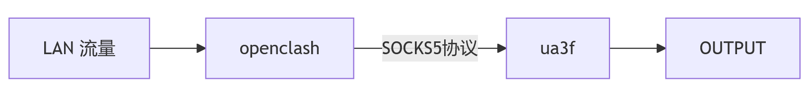
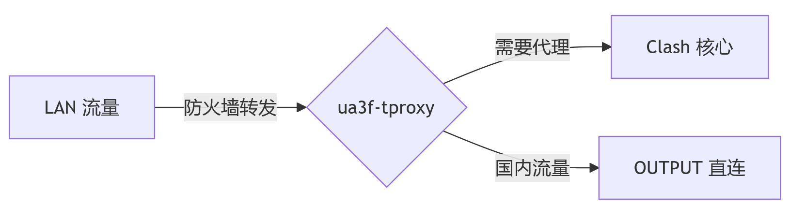
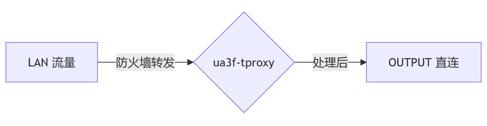
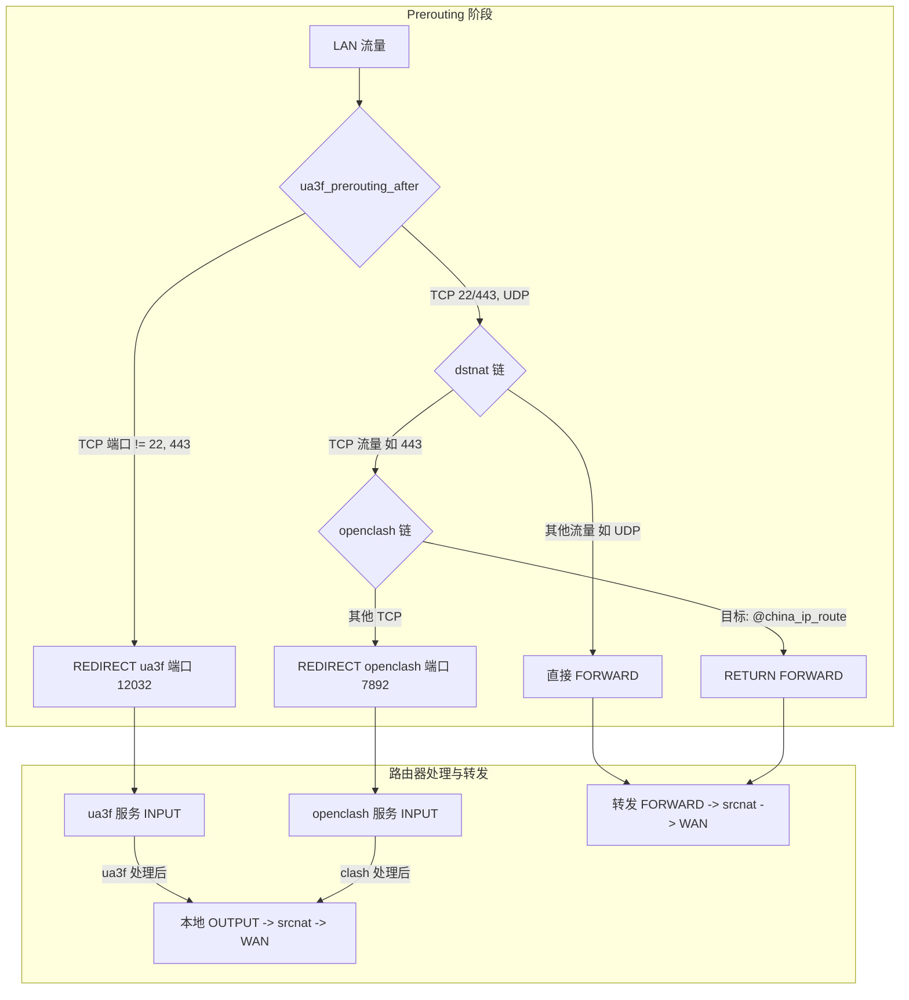

# UA3F-TProxy

`UA3F-tproxy` 是一个为 OpenWrt 设计的 User-Agent 修改工具，带 LuCI 配置界面。

它基于 [UA3F](https://github.com/SunBK201/UA3F) 重构，但使用 `TProxy (REDIRECT)` 方式重定向防火墙流量，实现了**高性能**和**低内存占用**。

## 解决了什么问题？

本项目主要用于解决**校园网环境对多设备共享上网的检测**问题。

与此前的解决方案相比：

  * **ua2f**: 需要特定的内核功能，必须手动编译固件，使用不便。
  * **ua3f (原版)**: 依赖 Clash 等代理服务通过 SOCKS5 转发，所有流量（包括国内）都需经过代理核心，性能开销和内存占用大，不适合低性能的硬路由。

`ua3f-tproxy` 解决了以上痛点，它**不依赖Clash**，性能高，配置极其简单。

## 核心特性

  * **一键启用**: LuCI 界面勾选启用，自动配置 `nftables` 防火墙，无需任何额外配置。
  * **高性能**: 采用 TProxy 架构，流量路径短，开销极低。
  * **低内存占用**: 不依赖 Clash 核心，内存占用仅 **数MB**。
  * **高兼容性**: 可与 `mwan3`, `openclash`, `sqm_qos` 等常见插件共存。
  * **无侵入**: 配置基于 UCI，卸载后不留防火墙残余。

## 架构对比

`ua3f-tproxy` 极大地优化了流量处理路径。

  * ** ua3f (Socks5 方案)**:
      * 所有流量（包括国内）都必须经过Clash，性能损失大。
      

  * ** ua3f-tproxy (TProxy 方案)**:
    * ua3f-tproxy + openclash
    
      * 优势: `ua3f-tproxy` 先处理流量。国内流量可不再经过 Clash 核心，预计提升 **50%** 性能。
    * ua3f-tproxy 
    
      *单纯的ua3f-tproxy,无需依赖openclash即可修改ua。
## 安装

我们提供两种安装方式：

### 1\. 预编译包 (推荐)

1.  前往 [Releases 页面](https://github.com/Zesuy/UA3F-tproxy/releases) 
2.  下载适用于您路由器架构 (如 `x86_64`, `aarch64_cortex-a53`, `mips_24kc` 等) 的 `.ipk` 安装包。
3.  将 `.ipk` 包上传到 OpenWrt 的 `/tmp` 目录。
4.  通过 SSH 或 Luci 终端执行安装：
    ```bash
    opkg install /tmp/luci-app-ua3f-tproxy_*.ipk
    ```

### 2\. 源码编译

1.  将本项目 `clone` 到您的 OpenWrt 编译环境的 `package/luci` 目录下。
2.  推荐在编译前make download,make j8,完成一次固件编译。完成后再编译软件包。
    ```bash
    make clean
    make package/UA3F-tproxy/compile
    ```

## 使用方法

**配置已完成！**

是的，你没看错。安装后，你只需要：

1.  在 LuCI 界面中找到 "服务" -\> "UA3F TProxy"。
2.  勾选 "启用"。
3.  点击 "保存并应用"。


插件会自动为你配置好所有防火墙转发规则。你也可以在界面中自定义监听端口和需要修改的 User-Agent 字符串。

## 兼容性与注意事项

  * **系统依赖**: 本项目基于 OpenWrt 23.05+ 构建，依赖 `nftables`。
  * **重要**: 为优化共存，`ua3f-tproxy` 特殊配置绕过了 `openclash` 输出的 `gid 65534`。若你使用 `Passwall` 或其他同样基于防火墙转发的代理服务，**兼容性未知，后果自负**。
  * **测试**: 已测试的平台：X86_64,环境openwrt 23.05,带有的插件：`openclash,sqm_qos,mwan3,wireguard`其余不影响防火墙的部分未列出。

## 性能优化细节

`ua3f-tproxy` 在解析 HTTP 请求时也做了优化：

  * **流式解析**: 应用从数据流头部开始寻找 `User-Agent` 字段。
  * **立即修改**: 一旦找到该字段，立即对其进行解析和修改。
  * **直接复制**: 该字段之后的所有请求头数据，全部通过 `io.copy` 直接转发，省去了完整解析 HTTP 头的内存与性能开销。

## 防火墙路线
防火墙详情
* ua3f_prerouting_after使用了dsnat-1来保证比openclash更先获取流量
* ua3f_output_after用来代理本机流量，使用特殊的gid来绕过openclash发出的流量。
