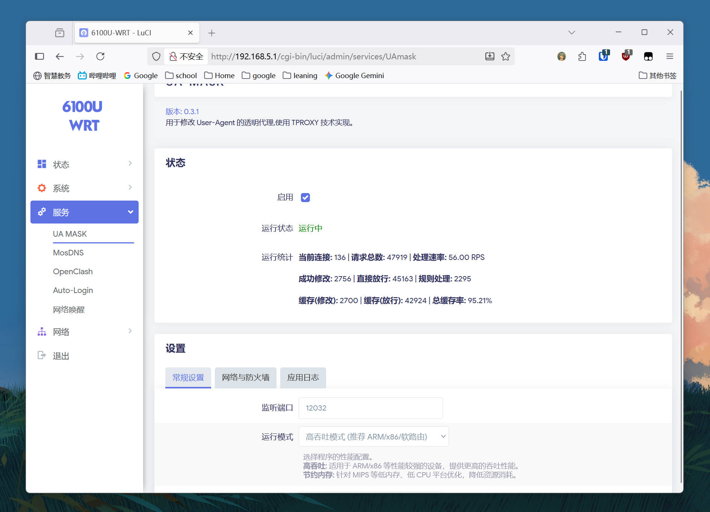

# UA-Mask

[](https://github.com/Zesuy/UA-Mask/releases)
[](https://github.com/Zesuy/UA-Mask/blob/main/LICENSE)


一个为 OpenWrt 设计的高性能、低内存 User-Agent 修改工具 (带 LuCI 界面)。

本项目主要用于解决**校园网环境对多设备共享上网的检测**问题。

原 **UA3F-tproxy** 现正式更名为 **UA-Mask** ([*更名详情与项目理念*](#about-the-name-change))。

> [!IMPORTANT]
>
> **项目现已原生支持 `iptables`！**
>
>  `UA-Mask` 现在可以完美运行在 **OpenWrt 21.02, 22.03** 等旧版固件上。
>
> - **OpenWrt 23.05+ 用户**: 请使用默认的 `nftables` 版本 (`UAmask_*.ipk`)。
> - **OpenWrt 21.02 / 22.03 用户**: 请从 Release 页面下载 `iptables` 版本 (`UAmask-ipt_*.ipk`)。
>
> 两者功能完全相同，且都与 OpenClash 等插件兼容。

## ✨ 特性

* **一键启用**: 自动配置 `nftables` 或 `iptables` 防火墙，开箱即用。
* **高性能 & 低内存**: 采用 Redirect 架构，开销极低；不依赖 Clash 核心，内存占用仅 **数MB**。
* **高效 UA 缓存**: 90% 以上请求命中 LRU 缓存，极大减少重复匹配开销。
* **灵活的匹配模式**: 支持关键词、正则表达式等多种模式。
* **高兼容性**: 可与 `mwan3`, `openclash`, `sqm_qos` 等常见插件完美共存。
* **实时状态统计**: LuCI 界面实时显示连接、速率与缓存命中率。
* **零泄露**: 无论是 HTTP 流量，非 HTTP 流量，还是先 HTTP 再加密的混合流量，都能正确处理连接中每个请求的 UA。 

## 架构对比

`UA-Mask` 极大地优化了流量处理路径。

#### 场景一：单独使用（推荐）

* 无需依赖 OpenClash 即可修改 UA，性能最高。

```mermaid
graph LR
    A[LAN 流量] --"防火墙转发"--> B{UAmask}
    B{UA-Mask} --> C[OUTPUT]
````

#### 场景二：与 OpenClash 配合 (完美分流)

  * **配置**：UA-Mask (代理本机: `关闭`) + openclash (代理本机: `开启`, 绕过大陆: `开启`)
  * **效果**：实现完美分流。非 `22/443` 端口流量先由 `UA-Mask` 修改 UA (HTTP)，再统一交由 `OpenClash` 接管。`OpenClash` 会将国内流量直连，国外流量走代理。
  * **备注**：此模式下，如果关闭 OpenClash 的“绕过大陆”，则所有流量（HTTP/HTTPS）都会先过 `UA-Mask` 再过 `OpenClash`。

<!-- end list -->

```mermaid
graph LR
    A[LAN 流量] --> B{防火墙规则}
    B -->|22 443 端口| C{OpenClash规则}
    B -->|其他端口| D[UA-Mask]
    
    C -->|国内流量| E[OUTPUT 直连]
    C -->|需要代理| F[Clash 核心]
    
    D --"本机代理开启"--> C{OpenClash规则}
```

#### 场景三：与 OpenClash 配合 (有缺陷，最大兼容)

  * **配置**：UA-Mask (代理本机: `关闭`) + openclash (代理本机: `关闭`，绕过大陆: `开启`)
  * **效果**: 这是一种**割裂**的配置。`OpenClash` 将**仅**代理被 UA-Mask 绕过的端口 (默认 `22`, `443`)。**不推荐使用**
  * **缺陷**: 所有其他端口（如 `80` 端口）的流量，在被 `UA-Mask` 修改 UA 后将**全部直连**，**不会**进入 OpenClash 走代理。

<!-- end list -->


## 运行统计

新的统计面板提供了更详细的性能数据。

  * **当前连接**: 实时的并发连接数。
  * **请求总数**: 程序检测到的 HTTP 请求总数。
  * **处理速率**: (请求总数 - 上次请求总数) / 刷新间隔，即 RPS。
  * **成功修改**: 成功修改 UA 的请求计数。
  * **直接放行**: 因白名单、不匹配规则等原因被放行的请求计数。
  * **规则处理**: 真正执行了“关键词”或“正则”匹配的请求数（即未命中缓存的请求）。
  * **缓存(修改)**: 命中缓存且决策为“修改”的请求数。
  * **缓存(放行)**: 命中缓存且决策为“放行”的请求数。
  * **总缓存率**: `(缓存(修改) + 缓存(放行)) / http请求数`。


## LuCI 界面




## 工作模式

  * **高吞吐模式**:
    使用 1000 条 LRU 缓存和 8K 的 I/O 缓冲区。适用于 ARM/x86 软路由等性能较强的设备。
  * **节约内存模式**:
    使用 200 条 LRU 缓存和 4K 的 I/O 缓冲区。针对 MIPS 硬路由等低内存、低 CPU 平台优化，降低资源消耗。

## 匹配模式

  * **基于关键词 (默认)**:
    当 UA 包含列表中的任意关键词时，替换整个 UA。性能最高，推荐。
  * **基于正则表达式**:
    使用正则表达式匹配 UA。
      * *完整替换*: 匹配成功后，将整个 UA 替换为新值。
      * *部分替换*: 匹配成功后，仅将 UA 中被正则匹配到的部分替换为新值。
  * **修改所有流量**:
    强制替换所有请求的 User-Agent，性能开销中等（低于正则，高于关键词）。

## 安装

我们为不同版本的 OpenWrt 提供了相应的预编译包。

### 1\. 确认您的防火墙类型 (重要)

在下载前，请先确认您的 OpenWrt 系统使用的是 `nftables` 还是 `iptables`。通过 SSH 连接到路由器后，执行以下命令：

```bash
# 如果执行 fw4 有响应, 说明是 nftables (通常是 OpenWrt 23.05+)
fw4 --version

# 如果执行 fw3 有响应, 说明是 iptables (通常是 OpenWrt 21.02, 22.03)
fw3 --version
```

### 2\. 下载并安装预编译包

1.  前往 [Releases 页面](https://github.com/Zesuy/UA-Mask/releases)。

2.  根据您的防火墙类型和路由器架构 (如 `x86_64`, `aarch64_cortex-a53` 等) 下载对应的 `.ipk` 包：

      * **对于 `nftables` 系统**: 下载 `UAmask_*.ipk`
      * **对于 `iptables` 系统**: 下载 `UAmask-ipt_*.ipk`

3.  将下载的 `.ipk` 包上传到 OpenWrt 的 `/tmp` 目录。

4.  通过 SSH 执行安装：

    ```bash
    # 安装 nftables 版本
    opkg install /tmp/UAmask_*.ipk

    # 或者安装 iptables 版本
    opkg install /tmp/UAmask-ipt_*.ipk
    ```

### 3\. 源码编译

1.  将本项目 `clone` 到您的 OpenWrt 编译环境的 `package/luci` 目录下。

2.  推荐在编译前 `make download` 和 `make j8`，完成一次固件编译。

3.  完成后再编译本软件包：

    ```bash
    make clean
    make package/UA-Mask/compile
    ```

    编译完成后将在 `$(rootdir)/bin/packages/$(targetdir)/base/` 中生成 `UAmask_xxx.ipk` 和 `UAmask-ipt_xxx.ipk`

    如果需要打包进固件，请在 `network/Web Servers/UAmask` 或者 `UAmask-ipt` 选择一个 `*`。

## 使用方法

安装后，你只需要：

1.  在 LuCI 界面中找到 "服务" -\> "UA-Mask"。
2.  勾选 "启用"。
3.  点击 "保存并应用"。

插件会自动为你配置好所有防火墙转发规则。你也可以在界面中自定义各项高级设置，例如运行模式、匹配规则、绕过端口等。

## 💡 兼容性与注意事项

  * **代理共存 (重要)**:

      * 如需和 OpenClash 等代理插件共存，请在 **UA3F-TPROXY** 的 "网络与防火墙" 设置中 **关闭** "代理主机流量" (`proxy_host`) 选项。
      * 同时，在 OpenClash 的设置中 **打开** "代理路由器流量" (或类似选项)。
      * 这可以确保流量正确分流，避免产生代理回环。
  * **更新配置**:

    * 从 `0.2.x` 版本升级到 `0.3.0+` (Reform) 版本后，由于配置变化巨大，建议删除旧的配置文件 (`/etc/config/ua3f-tproxy`) 并重新配置，或使用 `opkg` 升级时的 `-opkg` 备份文件覆盖。
  * **测试**: 已在 `X86_64` (OpenWrt 23.05) 平台测试通过，可与 `openclash`, `sqm_qos`, `mwan3`, `wireguard` 等插件正常协同工作。

## <a id="about-the-name-change"></a>关于更名与项目理念


 项目从 `UA3F-tproxy` 更名为 `UA-Mask` 的原因，以及我们的核心设计理念。
 
 ### 1. 更名契机
 
 * **原名由来**: `UA3F-tproxy` 意为“基于 UA3F 拓展构建的 TProxy 版本”。
 * **演进冲突**: 近期 `UA3F` 主项目也更新支持了 TProxy 和 Redirect 方法，这使得我的原项目名不再能体现独特性。
 * **功能革新**: `UA-Mask` 在更新过程中，我们完成了对 HTTP UA 的 100% 全覆盖修改、现了 LRU 缓存、高性能关键词匹配、以及为硬路由优化的“节约内存”模式 等关键更新。ua3f-tproxy” 不再能更好地体现我们项目的功能和特性。
 
 由此，我们决定更名项目为 **UA-Mask**。
 
 ### 2. 项目理念
 
 本项目灵感来自于 `UA3F`，旨在提供一个精简、高性能、一站式的 UA 修改代理。
 
 `UA-Mask` 是一个精简、高性能、一站式的 UA 修改工具。**我们只做一件事：以极致的性能 UA Masking**。
 
 我们的优化目标是：
 * **硬路由 (受限设备)**: 在 MIPS 等设备上稳定运行，优化热路径性能，消峰填谷保证稳定体验。
 * **软路由 (高性能设备)**: 在 ARM/x86 等设备上高效、高吞吐。
 
 我们从实现 UA 修改热路径上的缓存，到使用关键词匹配提供高性能选择，再到保证零拷贝 ，使用 Buffer Pool 优化 GC，并调整 Cache Size 以供受限设备流畅运行。我们将继续深入优化，分析性能热点，让每个路由器都能一键、高性能地完成检测绕过。


## todo
- [ ] 分析堆栈消耗以减少gc压力
- [ ] 添加防火墙绕过ip（如steamcdn）
- [ ] 添加Wtitepool , gcoc等高级调优选项
