# UA-Mask 使用教程

面向 OpenWrt 用户的一站式配置与排错指南，帮助你从 0 到 1 搭好 UA-Mask 并与 OpenClash 等共存。

## 目录

- [快速开始（5 分钟）](#快速开始-5-分钟)
- [界面字段详解（与 LuCI 一一对应）](#界面字段详解与-luci-一一对应)
- [与 OpenClash 共存](#与-openclash-共存)
- [运行统计详解（页面“状态”卡片）](#运行统计详解页面状态卡片)
- [流量卸载（基于 ipset/nfset）](#流量卸载基于-ipsetnfset)
- [防检测策略与推荐组合](#防检测策略与推荐组合)
- [匹配规则编写示例](#匹配规则编写示例)
- [验证与排错（必看）](#验证与排错必看)
  - [抓包定位 UA 泄露（tcpdump + Wireshark）](#抓包定位-ua-泄露tcpdump--wireshark)
- [工作模式（性能预设）](#工作模式性能预设)
- [安装与编译](#安装与编译)
- [附录：UCI 配置参考（/etc/config/UAmask）](#附录uci-配置参考etcconfiguAmask)
- [关于更名与项目理念（摘要）](#关于更名与项目理念摘要)
- [项目发展历史](#项目演进心路历程)
## 快速开始（5 分钟）

1) 安装（任选其一）

- 预编译包：到 Releases 下载与你设备架构匹配的 `.ipk`，然后在路由器上安装。
  - iptables 用户若要启用“流量卸载”，请先安装 ipset。

  ```sh
  opkg update
  opkg install UAmask_*.ipk
  # 仅 iptables 用户且需要 set 绕过时
  opkg install ipset
  ```

2) 打开 Web 界面：系统 -> 服务 -> UA-Mask，勾选“启用”，先别急着保存。

3) 常规设置（General）

- 性能预设：默认 Medium（大多设备够用）。
- User-Agent 标识（ua）：填一个“通用浏览器 UA”，例如：
  Mozilla/5.0 (Windows NT 10.0; Win64; x64) AppleWebKit/537.36 (KHTML, like Gecko) Chrome/119 Safari/537.36
- 匹配规则：保留“基于关键词（推荐）”。关键词默认已覆盖常见系统（Windows/Android/iPhone…）。

4) 网络与防火墙（Network）

- 监听端口：12032（默认）。
- 监听接口：br-lan（默认）。
- 代理主机流量：如果你的路由“本机”也需要被修改 UA，才开启。与 OpenClash 共存时建议遵循下文“完美分流方案”。
- 绕过目标端口：默认 22 443。
  - 若你“安全优先”，建议移除 443（原因见下文“安全优先方案”）。
- 启用流量卸载（可选，高性能）：iptables 用户务必先装 ipset。

5) 保存并应用。运行状态显示“运行中”。

6) 验证

- 从 LAN 内的一台设备访问[ua检验](http://ua.233996.xyz/)，应看到 UA 已变为你设定的值。

提示：UA-Mask 仅在“明文 HTTP”中可见效果；HTTPS 流量不会修改 UA（TLS 加密后 UA 不可见）。

---

## 界面字段详解（与 LuCI 一一对应）

### 1. 常规设置（General）

- 性能预设（operating_profile）
  - Low：200 并发，2000 LRU，8K 缓冲，内存占用最低。
  - Medium：500 并发，3000 LRU，8K 缓冲，均衡（默认）。
  - High：1000 并发，5000 LRU，8K 缓冲，高吞吐。
  - 自定义（custom）：自行设定缓冲/池/缓存/GOGC。
- I/O 缓冲区大小（buffer_size）：每连接读写缓冲，越大吞吐越高但更占内存。默认 8192。
- 工作协程池大小（pool_size）：限制最大并发、降低 GC；为 0 则每连接独立协程。
- LRU 缓存大小（cache_size）：提升命中率；约每 1000 条 ~300KB RAM。
- GOGC：Go GC 比例，使用协程池时建议保持 100。
- User-Agent 标识（ua）：实际替换成的 UA 字符串。
- 匹配规则（match_mode）
  - 基于关键词：UA 包含任一关键词即整串替换（性能最佳）。
  - 基于正则：配合“替换方式”使用（完整替换/部分替换）。
  - 修改所有流量：强制全改（一般不必）。
- 关键词列表（keywords）：逗号分隔，命中即整串替换。
- 正则表达式（ua_regex）：例如 (iPhone|Android|Windows)。
- 替换方式（replace_method）：正则命中后“完整替换”或“部分替换”。
- User-Agent 白名单（whitelist）：这些 UA 命中后直接放行（逗号分隔）。

### 2. 网络与防火墙（Network）

- 监听端口（port）：默认 12032。
- 监听接口（iface）：默认 br-lan，可多接口空格分隔。
- 启用流量卸载（enable_firewall_set）：创建 ipset/nfset 以“跳过”特定 ip:port，提高性能（见下节“流量卸载”）。
- UA 关键词白名单（Firewall_ua_whitelist）：命中这些 UA 关键词的连接，将目标 ip:port 动态加入 set 卸载（典型如 Steam）。
- 绕过非http流量（Firewall_ua_bypass）：当识别为“非 HTTP”后，交由决策器评估并暂时卸载该 ip:port，降低负载。
- 匹配时断开连接（Firewall_drop_on_match）：命中“UA 关键词白名单”时立即断开，强制新连接走卸载路径，加速生效。
- 代理主机流量（proxy_host）：是否也代理路由器自身的流量；为避免与其他代理回环冲突，若不需要可关闭。
- 绕过 GID（bypass_gid）：默认 65533，用于豁免自身流量；脚本同时豁免 OpenClash 的 65534，防循环。
- 绕过目标端口（bypass_ports）：默认“22 443”。
- 绕过目标 IP（bypass_ips）：默认局域网与保留网段。

### 3. 高级设置（决策器）

- 决策器设置（firewall_advanced_settings）：开启后可自定义卸载决策逻辑参数。
- 非 HTTP 判定阈值（firewall_nonhttp_threshold）：将某 ip:port 判定为“非 HTTP”前需累计的非 HTTP 事件次数（默认 5）。
- 决策延迟时间（秒）（firewall_decision_delay）：达到阈值后，延迟多久再做卸载决策，避免误判（默认 60s）。
- 防火墙规则超时（秒）（firewall_timeout）：加入 set 的元素超时（默认 28800 秒=8 小时）。

说明：
- 决策过程中如出现 HTTP 活动，会触发“HTTP 豁免期”，对该 ip:port 的卸载判定被一票否决并延后，进一步降低误判与 UA 泄露风险。

### 4. 应用日志（Softlog）

- 日志等级（log_level）：debug/info/warn/error 等。
- 应用日志路径（log_file）：建议放 /tmp，避免刷写闪存。
- 查看/清空日志：页面内置“查看最近 200 行”与“一键清空”。

---

## 与 OpenClash 共存

UA-Mask 已对 Clash 做了共存优化：即使开启了“代理本机”，也会自动豁免 Clash 的流量（GID 65534），避免循环。

### 完美分流方案（推荐）

- 配置：UA-Mask（代理本机：关闭）+ OpenClash（代理本机：开启，绕过大陆：开启）
- 效果：非 22/443 端口的 HTTP 流量先由 UA-Mask 修改 UA，再交给 OpenClash；OpenClash 将国内直连、国外走代理。
- 备注：若关闭 OpenClash 的“绕过大陆”，则所有 HTTP/HTTPS 都会先过 UA-Mask 再过 OpenClash。

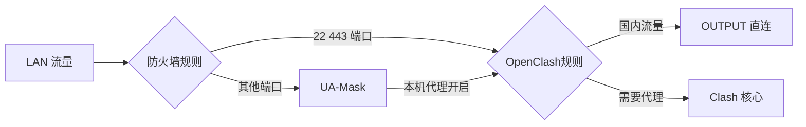

### 最大兼容方案（不推荐）

- 配置：UA-Mask（代理本机：关闭）+ OpenClash（代理本机：关闭，绕过大陆：开启）
- 效果：OpenClash 仅代理 UA-Mask 绕过的端口（默认 22/443）。
- 缺陷：其他端口（如 80）的流量在被 UA-Mask 修改后全部直连，不走 OpenClash。

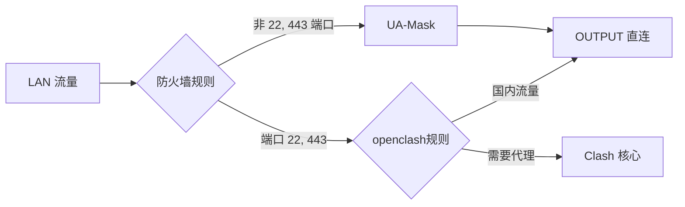

验证共存：

- iptables 机型：确保 UA-Mask 的 PREROUTING 规则在链首（服务重启会 -I 插入到最前）。
  ```sh
  iptables -t nat -nvL PREROUTING --line-numbers | sed -n '1,30p'
  iptables -t nat -S UAmask_prerouting
  ```
- nftables 机型：
  ```sh
  fw4 print ruleset | grep -n UAmask -n
  nft list set inet fw4 UAmask_bypass_set 2>/dev/null || true
  ```

---

## 运行统计详解（页面“状态”卡片）

- 当前连接：实时并发连接数。
- 请求总数：累计 HTTP 请求数。
- 处理速率：RPS（(当前总数-上次总数)/刷新间隔）。
- 成功修改：完成 UA 修改的请求数。
- 直接放行：因白名单/不匹配而放行的请求数。
- 规则处理：真正执行关键词/正则匹配（未命中缓存）的请求数。
- 缓存(修改)：缓存命中且判定“修改”的次数。
- 缓存(放行)：缓存命中且判定“放行”的次数。
- 总缓存率：(缓存(修改)+缓存(放行)) / HTTP 请求数。

---

## 流量卸载（基于 ipset/nfset）

为降低 CPU 负载、提升高并发性能，引入“流量卸载（set 绕过）”。启用路径：服务 -> UA-Mask -> 网络与防火墙 -> 勾选“启用流量卸载”。

iptables 用户：请先安装 ipset。

包含两种卸载：

1) 绕过非 http 流量（Firewall_ua_bypass）

- 原理：识别到某 ip:port 多次出现“非 HTTP”连接后，进入“决策延迟”观察期；若期间无 HTTP 活动，一次性加入 UAmask_bypass_set，超时后自动移除（默认 8 小时，可在“防火墙规则超时（秒）”调整）。
- 安全：若观察期内出现 HTTP 活动，会触发“HTTP 豁免期”，之前的非 HTTP 累积分数被一票否决，避免误判导致 UA 泄露。
- 效果：该 ip:port 的后续新连接被防火墙直接放行，不再进入 UA-Mask 检测，显著减负。

2) UA 关键词白名单（Firewall_ua_whitelist）

- 原理：若某连接的 UA 命中你配置的“UA 关键词”，立即把该目标 ip:port 加入 set 卸载。
- 适用：高带宽、长连接但 UA“无敏感标识”的流量（如 Steam 下载）。
- 示例关键词：Valve/Steam, steam, steamworks, 360pcdn, ByteDancePcdn（按需取舍）。
- 可选：匹配时断开连接（Firewall_drop_on_match）。命中后立刻断开现有连接，促使后续连接直接走卸载路径。可能会出现应用端“需重试”的提示，非苛求性能时可不启用。

重要提醒（性能 vs 风险）

- 被加入卸载 set 的 ip:port 在超时时间内会“完全绕过 UA-Mask”。这有可能导致“真实 UA 泄露”。请按你的环境权衡使用，尽量结合“非 HTTP 决策器”与谨慎的白名单关键词。

---

## 防检测策略与推荐组合

方案一：性能优先（大多数环境）

- 匹配规则：正则 + 部分替换（兼容性好）。
- 启用流量卸载；同时开启“绕过非 http 流量”和“UA 关键词白名单”（加入 Steam 等关键词）。

方案二：安全优先（严格环境）

- 关闭流量卸载与 UA 关键词白名单。
- 检查“绕过目标端口”中移除 443，以防极少数明文 HTTP 走 443 导致 UA 泄露。

---

## 匹配规则编写示例

- 关键词模式（整串替换）
  - 例：Windows,Linux,Android,iPhone,Macintosh,iPad,OpenHarmony
- 正则模式
  - 完整替换：ua_regex = (Windows NT|Android|iPhone|iPad|Macintosh)
  - 部分替换：把 UA 中的“Android [0-9.]+”替换为“Android 10”
    - ua_regex: Android [0-9.]+
    - 替换方式：部分替换
- 修改所有流量
  - 在 HTTPS 上也不会生效（因为 UA 位于明文 HTTP 头部）。

---

## 验证与排错（必看）

基础检查

- 进程：
  ```sh
  pidof UAmask || echo not running
  ```
- 日志：
  ```sh
  logread -e UAmask | tail -n 50
  tail -n 200 /tmp/UAmask/UAmask.log 2>/dev/null
  ```

防火墙规则

- iptables：
  ```sh
  iptables -t nat -S UAmask_prerouting
  iptables -t nat -S UAmask_output
  ipset list UAmask_bypass_set 2>/dev/null || true
  ```
- nftables：
  ```sh
  fw4 print ruleset | sed -n '/UAmask_/,+15p'
  nft list set inet fw4 UAmask_bypass_set 2>/dev/null || true
  ```

常见问题

- “HTTPS 看不到效果”：属正常，UA 仅在 HTTP 明文里；用 http://httpbin.org/user-agent 验证。
- “访问变慢/CPU 高”：尽量使用“关键词模式”；或改为 Medium/Low 预设；减少正则复杂度。
- “与 OpenClash 冲突/循环”：按本文“完美分流方案”设置；必要时重启 UA-Mask 使其规则位于更前面；保留绕过 GID 65534。
- “Steam 下载 UA 泄露担忧”：别启用“UA 关键词白名单”或仅在下载时短时启用；或不用 set 卸载。
- “运行统计不更新”：服务需运行一段时间才生成 /tmp/UAmask.stats；先确认进程与日志。
- “启动失败”：确认 /usr/bin/UAmask 存在；若启用流量卸载，iptables 机型需安装 ipset。

---

### 抓包定位 UA 泄露（tcpdump + Wireshark）

目标：在 WAN 侧抓包并用 Wireshark 检查是否存在“未被 UA-Mask 修改的明文 HTTP 请求”。

1) 确认 WAN 接口名（可能是 pppoe-wan/wan/eth0.2 等）
```sh
WAN="$(uci -q get network.wan.device || uci -q get network.wan.ifname || ifstatus wan | jsonfilter -e '@.device')"
echo "$WAN"
```

2) 抓取样本到路由器 /tmp/capture.pcap
- 轻量（常见明文 HTTP 端口）
```sh
tcpdump -i "$WAN" -s 0 -U -w /tmp/capture.pcap 'tcp port 80 or tcp port 8080 or tcp port 8000'
```
- 全量（30 秒，流量大时慎用）
```sh
timeout 30s tcpdump -i "$WAN" -s 0 -U -w /tmp/capture.pcap tcp
# 无 timeout 命令时，按 Ctrl+C 结束
```

3) 在 LAN 侧复现访问场景，然后停止抓包

4) 将抓包文件拉到本机
- Windows PowerShell（启用 OpenSSH 的情况下）
```powershell
scp root@192.168.1.1:/tmp/capture.pcap .
```
- 或使用 WinSCP/pscp.exe 图形或命令行工具

5) Wireshark 分析 UA
- 打开 capture.pcap，输入显示过滤器：
```
http.request and http.user_agent
```
- 将 http.user_agent 设置为列：在任意包的“http.user_agent”字段上右键 -> Apply as Column
- 若 HTTP 使用的不是 80 端口：
  - 方式 A：右键该端口的一个 TCP 包 -> Decode As... -> 选择 HTTP
  - 方式 B：Preferences -> Protocols -> HTTP -> TCP Ports，追加 8080,8000,8880,3128 等
- 判断是否存在“未被替换”的 UA（与 UA-Mask 配置值不一致的、或带有设备真实标识的 UA）

6) 若确认存在 UA 泄露，定位与修复
- 检查是否被加入卸载 set（会直接跳过 UA-Mask）：
```sh
# iptables 机型（ipset）
ipset list UAmask_bypass_set 2>/dev/null | sed -n '1,100p'
# nftables 机型
nft list set inet fw4 UAmask_bypass_set 2>/dev/null
```
- 临时移除可疑 ip:port：
```sh
# iptables 机型（hash:ip,port）
ipset del UAmask_bypass_set <ip>,<port>
# nftables 机型（ip . port 二元组）
nft delete element inet fw4 UAmask_bypass_set { <ip> . <port> }
```
- 调整配置后复测：
  - 关闭“绕过非 http 流量”
  - 清空或精简“UA 关键词白名单”（避免把高带宽下载目标加到卸载）
  - 安全优先时，在“绕过目标端口”移除 443
  - 确认 UA-Mask 规则优先级在前（见“与 OpenClash 共存/验证共存”命令）
  - 尽量使用“关键词模式”或“正则+部分替换”提升命中率与兼容性

## 工作模式（性能预设）

- Low：2000 LRU、8K 缓冲，协程池 200 —— 内存低。
- Medium：3000 LRU、8K 缓冲，协程池 500 —— 平衡（默认）。
- High：5000 LRU、8K 缓冲，协程池 1000 —— 高吞吐。
- 自定义：按需设定 cache_size、buffer_size、pool_size、GOGC。

---

## 安装与编译

### 预编译包

1. 前往 Releases。
2. 下载匹配架构的 `.ipk`。
3. 在路由器上安装（见“快速开始”）。

### 源码编译

1. 将本项目克隆到 OpenWrt 源码的 package/luci 目录。
2. 先完整编译过一次固件更稳（make download；并发编译如 make -j8）。
3. 编译本包：

```sh
make clean
make package/UA-Mask/compile
```

生成位置：$(rootdir)/bin/packages/$(targetdir)/base/ 下的 UAmask_xxx.ipk

固件内置：menuconfig 中 network/Web Servers/Proxies/UAmask 选中 *。

---

## 附录：UCI 配置参考（/etc/config/UAmask）

示例（默认值可能随版本略有调整）：

```conf
config 'UAmask' 'enabled'
    option enabled '0'

config 'UAmask' 'main'
    option port '12032'
    option ua 'FFF'
    option log_level 'info'
    option iface 'br-lan'
    option proxy_host '0'
    option bypass_gid '65533'
    option bypass_ports '22 443'
    option bypass_ips '172.16.0.0/12 192.168.0.0/16 127.0.0.0/8 169.254.0.0/16'
    option ua_regex '(iPhone|iPad|Android|Macintosh|Windows|Linux|Apple|Mac OS X|Mobile)'
    option whitelist ''
    option log_file '/tmp/UAmask/UAmask.log'

    # 运行参数（预设/自定义）
    # option operating_profile 'Medium|Low|High|custom'
    # option cache_size '3000'
    # option buffer_size '8192'
    # option pool_size '500'
    # option gogc_value '100'
    # option match_mode 'keywords|regex|all'
    # option keywords 'Windows,Linux,Android,iPhone,Macintosh,iPad,OpenHarmony'
    # option replace_method 'full|partial'

    # 流量卸载
    # option enable_firewall_set '0|1'
    # option Firewall_ua_whitelist ''
    # option Firewall_ua_bypass '0|1'
    # option Firewall_drop_on_match '0|1'

    # 决策器（高级设置开启后生效）
    # option firewall_advanced_settings '0|1'
    # option firewall_nonhttp_threshold '5'
    # option firewall_decision_delay '60'
    # option firewall_timeout '28800'
```

---

## 关于更名与项目理念（摘要）

- 更名：UA3F-tproxy 演进为 UA-Mask，突出“精简、高性能、专注 UA 修改”。
- 目标：硬路由可用、软路由高吞吐；热路径优化、零拷贝、缓存与池化，兼顾稳定与性能。

我们会持续打磨性能与易用性，让每台路由器都能一键获得更安全、稳定的 UA Mask 能力。

## 项目演进心路历程

1.  **此前方案**：最开始的方案是 `防火墙 -> OpenClash -> SOCKS5 -> UA3F`。这个方案虽然可行，但流量链路过长，导致 CPU 负载轻易达到瓶颈,直到后来萌生了自行实现的想法。
    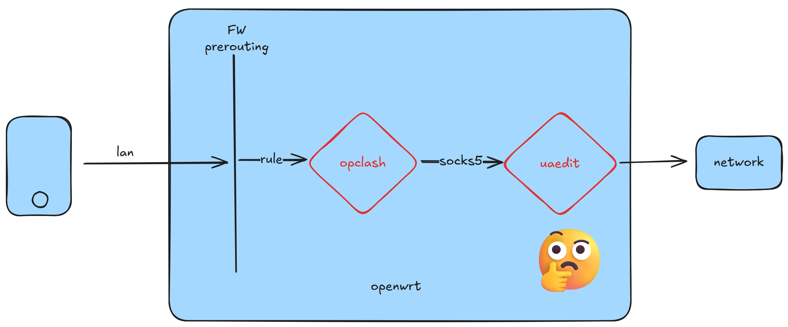
    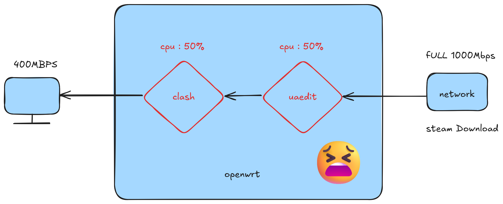

2.  **第一次优化**：为了解决性能问题，我们想到绕开 OpenClash，直接通过防火墙将流量转发给 UA-Mask（彼时还叫ua3f-tproxy）。这大大提升了处理效率。
    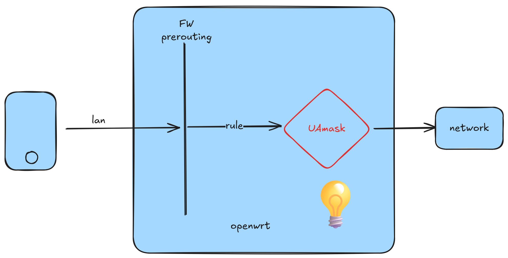

3.  **与 OpenClash 共存**：但新问题随之而来——如何与 OpenClash 共存？我们设计了新的方案：在 PREROUTING 链将流量先交给 UA-Mask，处理后再由 OUTPUT 链的 OpenClash 进行分流，并利用“绕过大陆”功能避免不必要的流量进入 Clash 核心。
    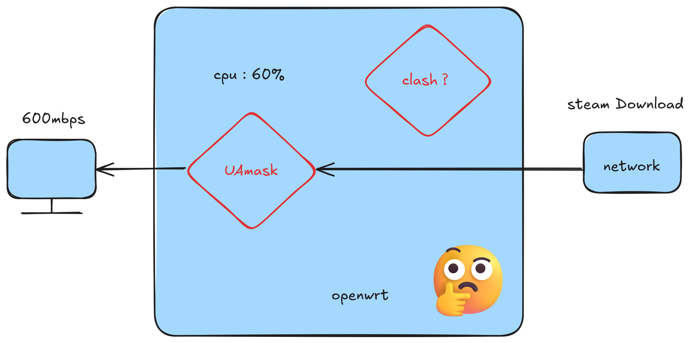
    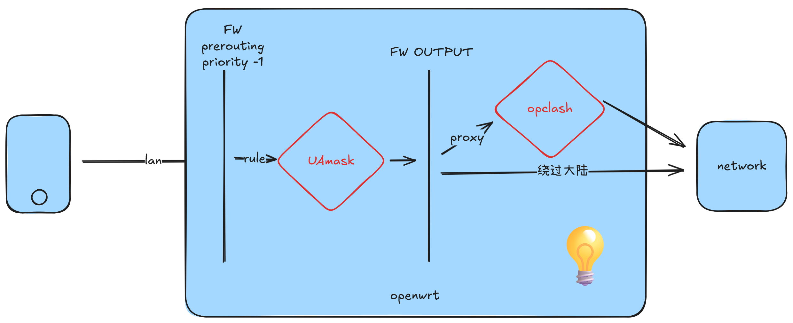

4.  **引入 ipset/nfset 卸载**：我们发现，超过 90% 的流量（如 Steam 下载）并不需要修改 UA。因此，引入 `ipset/nfset`，将这些高带宽流量动态加入卸载列表，使其直接通过内核转发，不再消耗 UA-Mask 的资源，实现了性能的飞跃。
    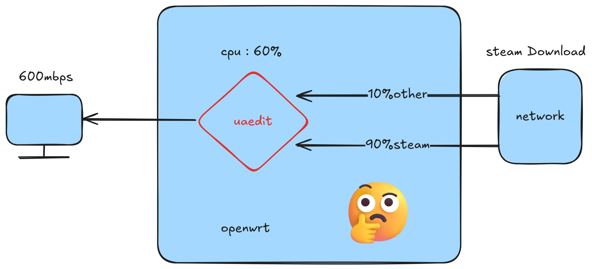
    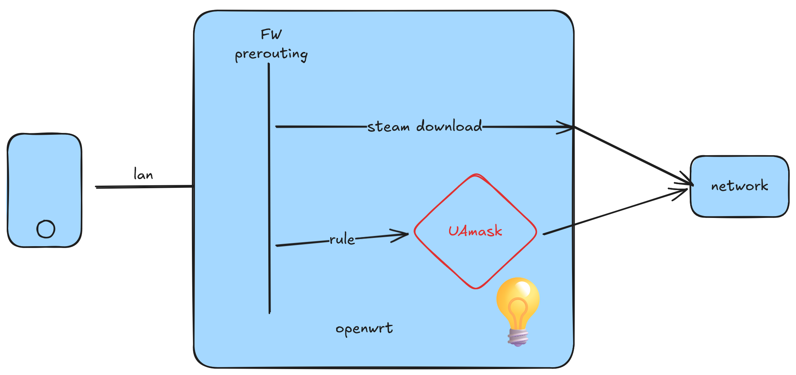
    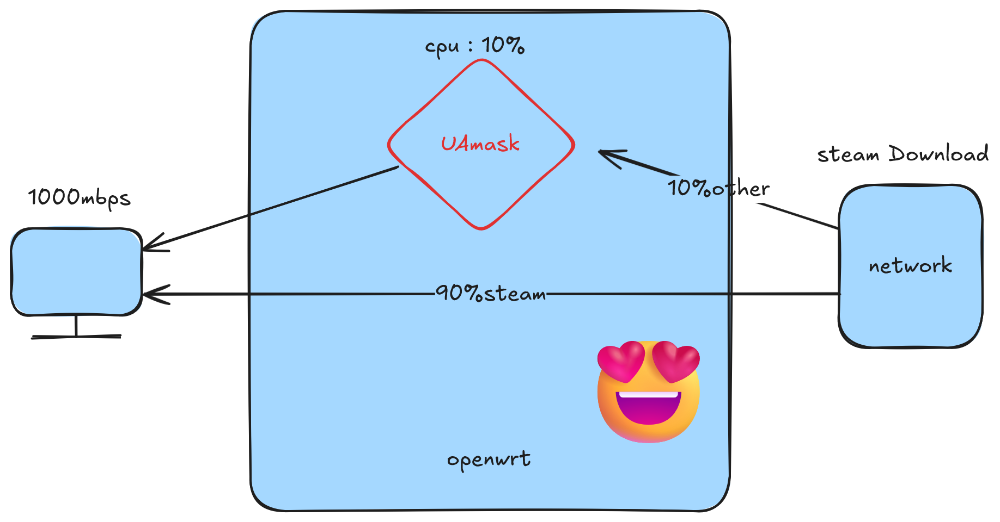

5.  **最终架构**：结合以上所有优化，形成了当前稳定、高效、兼容性强的最终架构。
    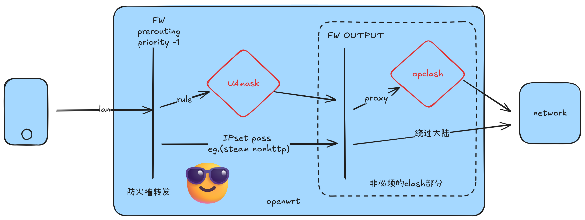